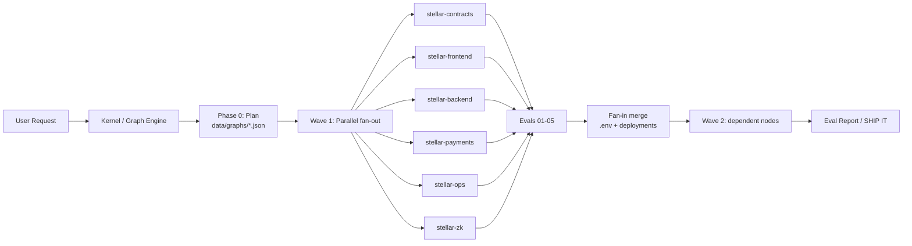

# SCF Build Award Application — Stellar Forge

**Track: Open Track** — novel developer tooling for AI-assisted Stellar development.

| Field | Value |
|---|---|
| Project Name | Stellar Forge |
| Builder / Team | Richie Christian De Guzman (solo builder) |
| Primary Contact | richiechristiandeguzman11@gmail.com |
| Referral | Via Philippines Ambassador Chapter (Instaward holder, see §3) |
| Repository | https://github.com/rylsherdamz-rgb/stellar-forge |
| XLM Mainnet Wallet | GCJJ7WCTRWLR7YLOWZH6VGCYKZ62HG2N7US7AUQPT762GDN7HFA4Y7Q5 |
| Requested Budget | $30,000 (paid in XLM) |
| Timeline | 4 months (3 tranches + acceptance tranche) |

> This submission is complete and self-contained. No external materials are referenced; all evidence is described in-submission and verifiable via the links provided.

---

## 1. Problem & Value to Stellar

**Problem.** Developers building on Stellar must assemble context from many distributed sources — Soroban docs, SDKs, Wallets Kit, x402, SEP/CAP specifications, reference implementations, and supporting tooling. AI coding assistants accelerate software development but are only as good as the context they are given; without a structured Stellar workflow, AI-assisted development produces inconsistent, poorly-verified Stellar code. This friction slows the ecosystem's developer onboarding at exactly the moment the network is growing its stablecoin and agentic-payments surface area.

**Value.** Stellar Forge is an open-source, eval-driven coding harness: an installable Skill (Claude Code), a companion CLI (`create-stellar-agentic`), 6 specialist agents (contracts, frontend, backend, payments, ops, zk) orchestrated through a persistent work graph, structured evals per agent zone, and a knowledge-graph layer for project architecture. It organizes existing Stellar tooling into a reproducible, verified development workflow — a public good that makes AI-assisted Stellar development consistent, reviewable, and safe.

**Differentiation.** General-purpose AI assistants and scaffolding tools (create-next-app, Cursor, Copilot) are not Stellar-aware. Existing Stellar resources (Soroban, SDK, Wallets Kit, x402) are well documented but distributed and unverified when AI-generated. Stellar Forge is the first framework that: (a) routes tasks to Stellar-specialist agents by zone, (b) enforces eval gates on every generated artifact (contract compile + WASM size, TypeScript, wallet connect, server startup, x402 flow), and (c) persists a machine-readable work graph so multi-agent builds run in parallel waves with verified fan-in. It does not replace AI assistants — it makes them Stellar-competent.

## 2. Stellar Use Case & Technical Integration

Stellar is the core of the framework, not an add-on:

- **Soroban contracts** — Rust/`#![no_std]` WASM development with `require_auth`, storage patterns, TTL extension, events; build/deploy via `stellar-cli` with testnet-gated deployment.
- **Stellar SDK + Wallets Kit** — frontend agents build against `useStellarData()`, `useContract().read()` (simulation, zero fees) and `useContract().write()` (sign+submit) — never raw RPC.
- **Agentic payments** — x402 (OZ Channels, fee-sponsored) and MPP Charge/Channel modes with USDC (SEP-41 SAC), CAIP-2 network IDs.
- **Standards & ZK** — SEP/CAP-aware routing; Groth16 verifiers over BLS12-381 (CAP-0059).
- **Verification** — 5 eval suites (`evals/01`–`05`) gate every node output; e2e harness runs against local Stellar + Playwright + Stellar Agentic Kit.

**Architecture outline (mermaid):**

**Ecosystem tools leveraged (not reinvented):** soroban-sdk, stellar-sdk, Stellar Wallets Kit, Stellar Agentic Kit, @x402/stellar + OZ Channels, stellar-cli, Playwright — all existing Stellar infrastructure.

## 3. Product Readiness & Traction

- **Instaward (Philippines Ambassador Chapter)** — Stellar Forge has an accepted-scope Instaward SOW (30-day sprint, $5,000) delivering the MIT-licensed skill + CLI + reference project validated on Stellar Testnet. This SCF application funds the next stage: production release and mainnet-validated reference dApps.
- **Working framework today** — the repository contains the full implementation: kernel graph engine, 6 agents, 5 eval suites, templates (contracts/frontend/backend/cicd), 10 skills (smart-contracts, dapp, data, assets, agentic-payments, zk-proofs, standards, stellar-mcp, frontend-design, graphify), npm package `create-stellar-agentic`, and a published docs site.
- **Validation signals** — test suites cover x402 flow, MPP Charge flow, and contract state against live RPC; e2e tests run via Playwright; CI (GitHub Actions) verifies the scaffold path.
- **Ecosystem need validated** — SDF's own focus on agentic payments (x402 Foundation, built-on-Stellar facilitator) and the SCF's active RFP for an "X402 Facilitator with Bazaar" confirm the ecosystem is prioritizing exactly the developer-tooling gap Stellar Forge addresses: reproducible, verifiable AI-assisted Stellar development.

## 4. Open Source Plan

- **License**: MIT — everything ships open source.
- **Open-sourced**: the Skill, CLI, kernel/work-graph engine, all 6 agent definitions, all 5 eval suites, templates, docs, and example reference dApps (including Soroban contracts — open-source plan for smart contracts included as required).
- **Location**: public GitHub repo + npm (`create-stellar-agentic`) + skills registry.

## 5. Budget — $30,000

Solo builder, 4 months (~480 engineering hours at $62.50/hr blended). Budget covers only Stellar-integrated development costs. No marketing, no audit costs (Audit Bank covers audits for eligible projects), no token giveaways, no legal fees.

| Tranche | % | Amount |
|---|---|---|
| #0 (acceptance) | 10% | $3,000 |
| #1 MVP | 20% | $6,000 |
| #2 Testnet | 30% | $9,000 |
| #3 Mainnet launch | 40% | $12,000 |
| **Total** | | **$30,000** |

| Category | Amount |
|---|---|
| Engineering (contracts, frontend, backend, payments, ops, zk agents + kernel) | $24,000 |
| Eval suites, e2e harness, testnet validation infrastructure | $3,600 |
| Documentation, docs site, reproducible examples, CI | $2,400 |
| **Total** | **$30,000** |

## 6. Tranches & Deliverables

### Tranche #1 — MVP (20%, $6,000) — Month 1

| # | Deliverable | Success criteria | Reviewer verification | Cost |
|---|---|---|---|---|
| 1.1 | Framework 1.0: kernel work-graph engine + 6 agents + 5 eval suites hardened | Full scaffold → build → eval → testnet-deploy workflow passes end-to-end | Repo CI green; `create-stellar-agentic` scaffolds a working project | $3,000 |
| 1.2 | CLI + templates (contracts, frontend, backend, cicd) polished | Clean-environment scaffold works from docs alone | Fresh-environment reproduction recorded (`docs/REPRODUCIBILITY.md` §2) | $1,500 |
| 1.3 | Eval suites extended to payment + zk zones | x402 flow + contract-state eval suites pass | Test suite output in CI (`.github/workflows/ci.yml` test job) | $1,500 |

### Tranche #2 — Testnet Expansion (30%, $9,000) — Months 2–3

| # | Deliverable | Success criteria | Reviewer verification | Cost |
|---|---|---|---|---|
| 2.1 | Testnet-validated reference dApp (token contract + wallet UI + paid API via x402) | Deployed on Stellar Testnet; contract ID + tx hashes captured | Explorer links + `data/deployments/` registry | $3,500 |
| 2.2 | E2E harness: local Stellar + Playwright + Agentic Kit hooks | e2e suite runs in CI and locally | CI logs + badge | $2,000 |
| 2.3 | Threat model + monitoring plan (STRIDE-aligned) | Threat model covering generated-code, credential, supply-chain, eval-bypass risks; monitoring metrics, emissions, triggers defined | Docs in submission repo (§6.3) | $1,000 |
| 2.4 | Clean-environment reproducibility + knowledge-graph (graphify) integration | Second developer reproduces workflow from clean setup; project knowledge graphs generated | Reproduction video + graph output | $2,500 |

**Threat model + monitoring plan summary (Tranche #2 requirement):** threats identified via STRIDE include (a) eval bypass — generated artifacts accepted without verification, mitigated by eval-gating as a hard gate; (b) credential leakage — agents never write secrets, `.env` is kernel-owned and git-ignored; (c) dependency supply chain — pinned versions, CI provenance checks; (d) contract vulnerabilities — `require_auth` enforcement in eval checks, WASM size gates, testnet-only auto-deploy. Monitoring plan: CI health dashboards, deployment registry audit trail (`data/deployments/` with network/ID/WASM hash/timestamp), eval pass-rate tracking per zone, npm package download + install telemetry, and alerting on CI and testnet-deployment failures. Full documentation follows the [Threat Modeling Guide](https://developers.stellar.org/docs/build/security-docs/threat-modeling) and [Monitoring Plan Template (Builders)](https://developers.stellar.org/docs/build/security-docs/monitoring/monitoring-template-builders).

**Already shipped ahead of schedule (as of submission):**
- `docs/THREAT-MODEL.md` — STRIDE threat model over 6 assets, 4 trust boundaries, 17 identified threats, top-2 attack trees, outstanding-risk checklist (tranche 2.3 ✓)
- `docs/MONITORING-PLAN.md` — metrics, thresholds, alerting, incident response, ownership table (tranche 2.3 ✓)
- `docs/MARKET-ANALYSIS.md` — business + technical analysis per Open Track requirements ✓
- `docs/REPRODUCIBILITY.md` — clean-environment reproduction guide, version-pin table verified against npm registry ✓
- `packages/forge-gateway/` — Forge Gateway: remote Stellar-context MCP server (Raven-style) with catalog search + sandboxed `execute`, playground, and daily live-service checks; 10/10 unit tests green; live checks currently passing for Soroban RPC, Horizon, npm, docs site, GitHub (tranche 3.x adjacent, shipped early)
- CI now runs gateway + framework tests on every push (`.github/workflows/ci.yml`)
- `templates/contracts/vault/` — Forge Vault: trustless milestone-escrow contract (deposit → claim via sha256 release-key proof, arbiter release, deadline recovery); **9/9 unit tests passing**; compiled WASM 21,562 bytes (tranche 1.x adjacent, shipped early)
- **Testnet deployment live:** Forge Vault deployed to Stellar Testnet as `CB2JGINPQP6DSWEY6N5XOWOSVOW6IPCNLSM2AQWVKP3LTVSQ3SQSHKFZ` — recorded in `data/deployments/testnet.json` (network, ID, WASM hash, timestamp); verified executable via public RPC: `stellar contract invoke ... -- total_committed` → `"0"` (tranche 2.1 evidence ✓)
- **Framework suite passing against live services:** x402 payment flow (402 → paid 200) + MPP charge flow (health + balance lookup) + contract-state RPC check — **3/3 suites green** against a live local backend + Soroban testnet RPC (tranche 2.1 evidence ✓)

### Tranche #3 — Mainnet Launch (40%, $12,000) — Month 4

| # | Deliverable | Success criteria | Reviewer verification | Cost |
|---|---|---|---|---|
| 3.1 | Production release: v1.0 tag, npm publish, skills registry listing | `npx create-stellar-agentic` installs from npm | npm page + release tag | $3,000 |
| 3.2 | Reference dApp live on Stellar Mainnet (token + wallet + paid endpoint) | Mainnet contract deployed + activated; paid request served end-to-end | Explorer links + tx hashes + demo | $4,500 |
| 3.3 | Docs site + onboarding guides + reproducible examples | Developer goes from docs to mainnet-validated app | Docs site + clean-setup run | $2,500 |
| 3.4 | Community launch: framework adoption kit, contribution guide, roadmap | Public contribution guidelines + adoption tutorial; monitoring live (per 2.3) | Repo + monitoring dashboard | $2,000 |

**Tranche deadlines**: each tranche submitted within 90 days of the previous payment, per the SCF Build Award rules.

## 7. Team & Build Readiness

- Solo builder with full-stack Stellar experience; shipped the complete framework (kernel, agents, evals, CLI, docs site) already working on testnet.
- Roadmap and technical plan are fully defined; the work graph is the project's own planning artifact — tranches above map 1:1 to the framework's execution waves.
- Ready to begin immediately on award.

## 8. AI-Assisted Artifact Disclosure (Open Track)

This project is itself an AI-assisted development framework, and its development uses AI-assisted workflows. Full disclosure: the kernel, agent definitions, eval suites, templates, this application, and supporting documentation are AI-assisted artifacts, built and verified through the framework's own eval-driven process on Stellar Testnet. All artifacts are open source for independent review.

## 9. Evidence Plan

| Tranche | Evidence |
|---|---|
| #1 | Public repo, CI logs, scaffold output, eval suite results |
| #2 | Testnet contract IDs + tx hashes + explorer links, deployment registry, threat model + monitoring plan docs, reproduction video, knowledge-graph output |
| #3 | npm release, mainnet contract IDs + tx hashes + explorer links, docs site, demo video, monitoring dashboard |